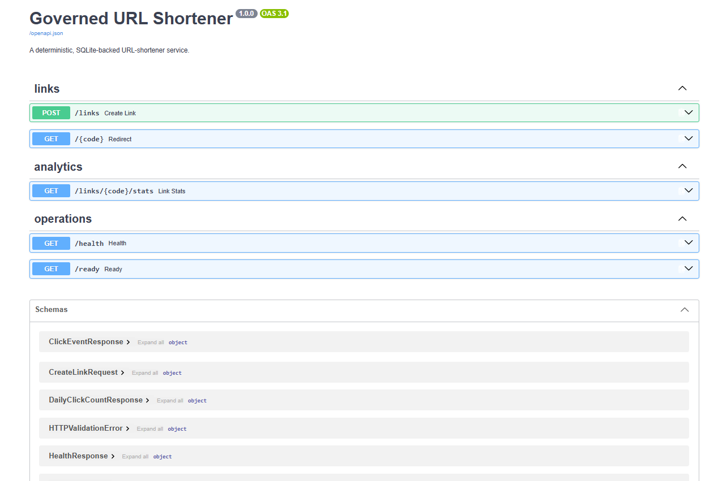
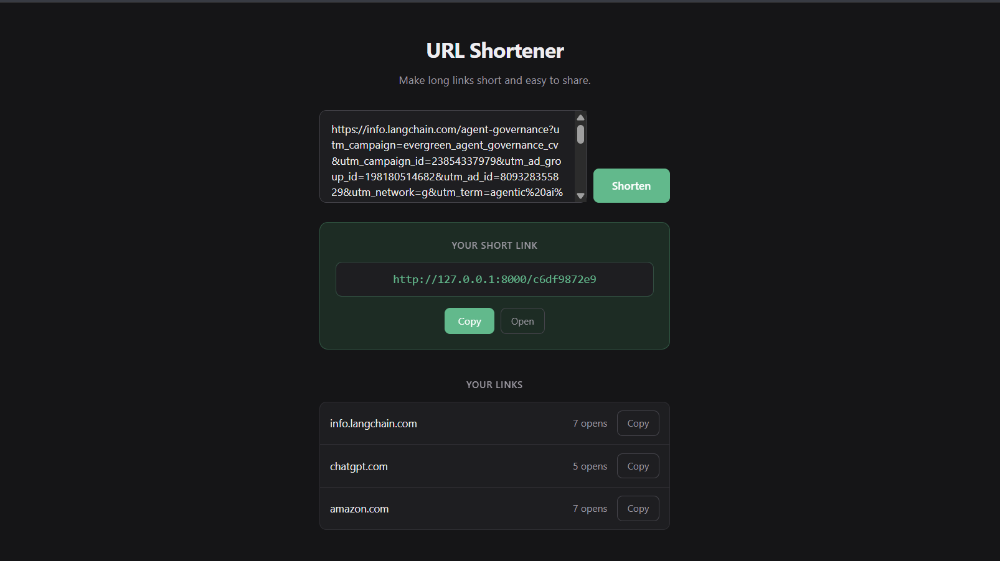

# GovFlow

**A governed agentic SDLC orchestration engine, demonstrated by building and then
evolving a URL-shortener service.**

The orchestration layer is the deliverable. The URL shortener is the realistic
engineering work it governs.

---

## Table of contents

1. [What this is and why](#1-what-this-is-and-why)
2. [Approach and the central design choice](#2-approach-and-the-central-design-choice)
3. [Architecture](#3-architecture)
4. [Setup and running it](#4-setup-and-running-it)
5. [The URL shortener](#5-the-url-shortener)
6. [The orchestration layer](#6-the-orchestration-layer)
   - [Dependency graph and the DAG](#61-dependency-graph-and-the-dag)
   - [Gates](#62-gates)
   - [Policies](#63-policies)
   - [Human-in-the-loop approval](#64-human-in-the-loop-approval)
   - [Retry, fallback, compensation, safe-stop](#65-retry-fallback-compensation-safe-stop)
   - [Re-planning](#66-re-planning)
   - [Audit trail and metrics](#67-audit-trail-and-metrics)
7. [The three scenarios](#7-the-three-scenarios)
8. [Test approach and evidence](#8-test-approach-and-evidence)
9. [Decisions and trade-offs](#9-decisions-and-trade-offs)
10. [Limitations and what was not built](#10-limitations-and-what-was-not-built)
11. [What I would do next](#11-what-i-would-do-next)
12. [Deliverables map](#12-deliverables-map)
13. [Repository layout](#13-repository-layout)
14. [Browser client](#14-browser-client)

---

## 1. What this is and why

### The problem

Getting an AI system to write code is no longer the hard part. Getting it to
execute a **software engineering lifecycle** you would let near a real codebase
is. That means answering questions a code generator never has to:

- What happens when work in flight turns out to be wrong?
- Who approved the risky step, and can that approval be forged?
- Which downstream work is invalidated when an upstream requirement changes —
  and which is safe to keep?
- When something fails repeatedly, does the system stop safely, or keep going and
  report success anyway?
- Can a reviewer reconstruct **why** the system did what it did, six weeks later?

An agent that emits a pull request answers none of these. This project is an
attempt at the layer that does.

### What it does

GovFlow turns a requirement into a governed execution run:

- A versioned, normalized statement of the problem, with ambiguities surfaced
  rather than silently resolved.
- An explicit task DAG spanning requirements → design → implementation → testing
  → documentation → release readiness.
- Stateful, non-linear execution: parallel branches that fork and synchronize at
  a join, entry/exit gates that fail closed, conditional transitions.
- Human approval on high-impact work, enforced so that an agent **cannot** grant
  it.
- Bounded retry, governed fallback, compensating action, and a safe stop that
  never claims success.
- Policy guardrails for security, privacy, change control and evidence
  retention — recording allows as well as denials.
- An append-only event stream that every other view is projected from.
- Governed re-planning when an upstream requirement changes, preserving the
  prior version's history rather than overwriting it.

### The thing being governed

A working URL shortener: create a short link, redirect, privacy-conscious click
analytics, health and readiness, SQLite persistence, and a published OpenAPI
contract. It is deliberately small. It exists so the orchestration has real
engineering work to coordinate — code, tests, a contract, docs, and a bug worth
fixing — rather than simulated tasks.

---

## 2. Approach and the central design choice

### Governance is the product; execution is a seam

The single most important line in the codebase:

```python
class TaskExecutor(Protocol):
    def execute(self, task: Task, inputs: dict[str, str]) -> TaskOutput: ...
```

That is the entire contract between the control plane and the work. An executor
performs work and reports outputs or failure. It **cannot** mutate engine state,
write events, assign artifact ids or versions, or decide a gate or policy
outcome. The engine owns all of that.

The consequence: the governance layer is indifferent to *how* work gets done.
Two credential-free implementations ship: `DeterministicExecutor`, retained as
the direct task-handler path, and `AgentRegistry`, used by all three scenarios.
The registry first routes `Task.capability` to its owning `Agent`, then routes
the task id to that agent's handler. A model-backed executor could still slot
into the same seam without changing gates, approvals, recovery, or audit.

**This is also the project's most debatable decision, so it is stated plainly:**
no LLM is invoked anywhere in the default path. See
[§9](#9-decisions-and-trade-offs) and [§10](#10-limitations-and-what-was-not-built).

### A frozen contract, built against in parallel

`orchestrator/contracts.py` is frozen and is the design. Types, both state
machines, and the invariants live there and nowhere else. Every other module —
engine, policies, scenarios, evidence export, tests — was built against it
concurrently. Three invariants are encoded in the types rather than left to
convention:

1. **Events are append-only.** `Event` is immutable. Re-planning adds records; it
   never deletes them.
2. **Transitions are explicit.** `LEGAL_TASK_TRANSITIONS` and
   `LEGAL_RUN_TRANSITIONS` are the whole state machine. The engine *asks*; it
   does not decide. Illegal moves fail closed.
3. **Approval is attributable to a human.** `Approval` rejects a non-human actor
   at construction, and the engine re-checks it, so an agent cannot approve its
   own high-impact work.

### Determinism as a reviewer feature

Time and identity are injected (`orchestrator.clock`). Nothing calls
`datetime.now()` or `uuid4()` in the engine. Run a scenario twice and the
structure, ordering, and ids are identical — which is what makes an evidence
bundle diffable and a governance claim checkable rather than assertable.

### Adversarial verification

The negative test suite was written by an agent that did **not** implement the
engine, working from the specification rather than the implementation. Tests
written by the implementer tend to assert the implementation back to itself. That
separation found a real defect: the engine accepted an approval whose actor was
an agent when the model validator was bypassed. It is fixed, and
`test_engine_refuses_an_agent_granted_approval` now stands on it.

---

## 3. Architecture

```
                    ┌──────────────────────────────────────────────┐
   requirement ───► │  orchestrator/  — the control plane          │
                    │                                              │
                    │   contracts.py   frozen types + state machines│
                    │   graph.py       DAG validation, topology     │
                    │   engine.py      gates, transitions, re-plan  │
                    │   policy.py      named guardrails             │
                    │   approval.py    human decisions              │
                    │   recovery.py    retry/fallback/compensate    │
                    │   events.py      append-only JSONL store      │
                    │   agents.py      capability-owned dispatch    │
                    └───────────────┬──────────────────────────────┘
                                    │  TaskExecutor.execute(task, inputs)
                                    ▼           ── the only seam ──
                    ┌──────────────────────────────────────────────┐
                    │  scenarios/  — assembles plans + agents       │
                    │  S-01 ──► S-02 ──► S-03   (strictly ordered)  │
                    └───────────────┬──────────────────────────────┘
                                    │  operates on
                                    ▼
                    ┌──────────────────────────────────────────────┐
                    │  app/  — the governed work product           │
                    │  FastAPI + SQLite URL shortener              │
                    └──────────────────────────────────────────────┘
                                    │
                                    ▼
                          evidence/<run_id>/   ← emitted, never hand-written
```

| Module | Responsibility |
|---|---|
| `orchestrator/contracts.py` | Frozen types, both state machines, invariants. Do not modify. |
| `orchestrator/graph.py` | Validates identifiers, dependencies, cycles, artifact producers and ancestry. Deterministic topological order and readiness frontier. |
| `orchestrator/engine.py` | Owns run state. Applies entry gates, policies, approval, execution, exit gates, recovery, selective invalidation. |
| `orchestrator/policy.py` | Four named policies producing `PolicyDecision` for allow *and* deny. |
| `orchestrator/approval.py` | Request registry and immutable human decisions. |
| `orchestrator/recovery.py` | Retry/compensate/safe-stop choice, plus metrics projected from events. |
| `orchestrator/events.py` | Append-only store with a monotonic per-run `seq`, persisted as JSONL. |
| `orchestrator/executor.py` | The `TaskExecutor` seam and direct deterministic implementation. |
| `orchestrator/agents.py` | Named role agents and fail-closed capability -> task-handler dispatch. |
| `scenarios/` | The three runs, the dependency-aware runner, the CLI, and the evidence exporter. |
| `app/` | The URL shortener being governed. |
| `web/` | React browser client for the shortener API. Consumes `app/`; the engine neither knows nor depends on it. |

### Control flow for a single task

```
PENDING
  └─ dependencies satisfied? ────────────────────────► READY
       ├─ entry gates          ── denied ───────────► BLOCKED
       ├─ required policies    ── denied/unevaluated► BLOCKED
       ├─ impact HIGH/BREAKING? ──────► AWAITING_APPROVAL
       │                                   ├─ human grants ──► RUNNING
       │                                   └─ withheld ─────► BLOCKED
       └─ else ─────────────────────────────────────► RUNNING
            └─ executor.execute()
                 ├─ success + exit gates pass ──────► SUCCEEDED
                 ├─ exit gates fail ────────────────► BLOCKED
                 └─ failure
                      ├─ transient + budget left ──► RETRYING ──► RUNNING
                      └─ exhausted / non-transient ► FAILED
                                                       └─ compensation ──► COMPENSATED
                                                            └─ run ──────► SAFE_STOPPED
```

Every arrow is checked against the frozen transition table before it is taken.

---

## 4. Setup and running it

Python 3.11 or newer. No credentials, no network, no Docker, no cloud.

**Windows (PowerShell):**

```powershell
python -m venv .venv
.venv\Scripts\python.exe -m pip install -e ".[dev]"
.venv\Scripts\python.exe -m scenarios.cli run all
```

**macOS / Linux:**

```bash
python3 -m venv .venv
.venv/bin/python -m pip install -e '.[dev]'
.venv/bin/python -m scenarios.cli run all
```

That one command runs S-01 → S-02 → S-03 in dependency order and writes an
evidence bundle per scenario to `evidence/<run_id>/`. Expected output:

```
s-01: succeeded    - all tasks succeeded
s-02: safe_stopped - Persistent release verification exhausted its retry budget;
                     the registered handler restored the S-01 release candidate
                     and the run safe-stopped.
s-03: succeeded    - Requirement v2 shipped UTC-day analytics after selective
                     invalidation, re-applied controls, complete validation, and
                     human quality approval.
```

**`s-02: safe_stopped` is the intended outcome, not a failure.** It is the
scenario that proves the system stops safely instead of claiming success. The
command exits 0.

Start at `evidence/s-01-greenfield/index.json` — it manifests every other file
with a content hash.

### Run the tests

```powershell
.venv\Scripts\python.exe -m pytest tests/ -q      # 218 tests
```

### Run the service

```powershell
$env:URL_SHORTENER_DB = "data\reviewer.db"
.venv\Scripts\python.exe -m uvicorn app.main:app --host 127.0.0.1 --port 8000
```

Then open **http://127.0.0.1:8000/docs** for Swagger UI, or in a second window:

```powershell
$created = Invoke-RestMethod -Method Post -Uri http://127.0.0.1:8000/links `
  -ContentType application/json -Body '{"destination":"https://example.com"}'
curl.exe -i "http://127.0.0.1:8000/$($created.code)"
Invoke-RestMethod "http://127.0.0.1:8000/links/$($created.code)/stats"
```

On macOS/Linux use `export URL_SHORTENER_DB="data/reviewer.db"` and
`.venv/bin/python`.

### Run the browser client

`web/` is a React client for the shortener API — see
[§14](#14-browser-client). The scenario chain and the test suite do not depend on
it, so skip this if you only want the orchestration engine.

Requires **Node.js 20+**. It talks to the API, so start the service first and
leave it running, then use a second terminal:

```powershell
# terminal 1 — the API (from the repository root)
$env:URL_SHORTENER_DB = "data\reviewer.db"
.venv\Scripts\python.exe -m uvicorn app.main:app --host 127.0.0.1 --port 8000

# terminal 2 — the client
cd web
npm install
npm run dev
```

macOS / Linux:

```bash
# terminal 1
export URL_SHORTENER_DB="data/reviewer.db"
.venv/bin/python -m uvicorn app.main:app --host 127.0.0.1 --port 8000

# terminal 2
cd web && npm install && npm run dev
```

Open **http://localhost:5173**.

| Command | Does |
|---|---|
| `npm run dev` | Dev server with hot reload on :5173 |
| `npm run build` | Type-check and build to `web/dist/` |
| `npm run preview` | Serve the production build locally |

The client defaults to an API at `http://127.0.0.1:8000`. Point it elsewhere with
`VITE_API_BASE`:

```powershell
$env:VITE_API_BASE = "http://127.0.0.1:9000"; npm run dev
```

If the page loads but nothing works, the API is either not running or is running
on a different port — the two are indistinguishable to the browser, because a
blocked cross-origin request and an unreachable server both surface as the same
network error.

---

## 5. The URL shortener

A deliberately small but complete vertical slice: API, domain, persistence,
tests, and a published contract.

| Endpoint | Behaviour |
|---|---|
| `POST /links` | Create from a validated destination. Returns 201 with the code and a `Location` header. |
| `GET /{code}` | 307 redirect to the destination, recording one click. |
| `GET /links/{code}/stats` | Aggregate click count, recent timestamps, coarse UTC-day buckets. |
| `GET /health` | Liveness. |
| `GET /ready` | Readiness — 503 when SQLite is unavailable. |
| `GET /openapi.json` | Machine-readable contract, emitted by FastAPI. |

The contract is emitted by FastAPI rather than maintained by hand, so it cannot
drift from the code. It is browsable at `/docs` while the service is running:



**Deterministic short codes.** `sha256(destination)` truncated to 10 hex
characters, with a forward walk on collision. Two consequences that matter: the
same destination always yields the same code (idempotent creation, no duplicate
rows), and collision handling is reproducible rather than random.

**Privacy by construction.** A click row stores a timestamp and nothing else — no
IP address, no user agent, no cookie, no fingerprint. This is asserted at the
schema level by
`tests/test_shortener_service.py::test_click_storage_contains_no_raw_client_identifier_columns`,
which fails if a raw-identifier column is ever added.

**Input safety is enforced twice, deliberately.** Pydantic rejects non-HTTP(S)
schemes and embedded credentials at the API edge with a 422; the `url-safety`
policy independently denies the same class of destination inside the workflow.
They are separate controls at separate layers, and the negative tests cover both.

**Restart-safe.** Verified live, not just in-process: the service was stopped and
restarted against the same SQLite file, and links and click counts survived
(`test_links_survive_repository_restart`).

---

## 6. The orchestration layer

### 6.1 Dependency graph and the DAG

A `Plan` is a versioned tuple of `Task`s. Each task declares:

This is the real S-01 join task:

```python
Task(
    id="integrated-validation",
    stage=Stage.TESTING,
    capability="quality-engineer",              # role expected to do the work
    depends_on=("implement-core", "implement-analytics-reliability"),
    consumes=("core_implementation", "analytics_reliability_implementation"),
    produces=("integrated_validation", "smoke_result"),
    impact=ImpactClass.LOW,
    entry_gates=(...), exit_gates=(...),        # declared-inputs-fresh, declared-outputs-present
    retry_budget=1,                             # the transient failure S-01 recovers from
)
```

**`consumes` and `produces` are logical artifact names, not task ids.** That
indirection is what makes a join meaningful: a join declares the *inputs* it
needs, and cannot start until every one exists, is fresh, and its producer passed
its exit gates. Ordering alone is not synchronization.

`DependencyGraph` rejects a malformed plan at construction — before anything
executes:

| Rejected | Why |
|---|---|
| dependency cycle | not a DAG |
| unknown dependency id | dangling reference |
| self-dependency | never satisfiable |
| duplicate task id | ambiguous addressing |
| consumed artifact nobody produces | unsatisfiable input contract |
| one artifact with two producers | ambiguous provenance |
| consumed artifact whose producer is not a dependency ancestor | an unordered read — the value would depend on execution timing |

That last rule is the subtle one, and it is what makes freshness enforceable
rather than best-effort.

**Roles.** `capability` selects the agent that owns each task —
`business-analyst`, `product-owner`, `solution-architect`, `brownfield-analyst`,
`backend-engineer`, `reliability-engineer`, `quality-engineer`,
`release-quality-engineer`, `technical-writer`, `delivery-lead`,
`release-manager`, `release-engineer`, `privacy-owner`, `quality-owner`.

`AgentRegistry` performs two-level dispatch: the capability resolves a named
`Agent`, then that agent resolves the task id in its own handler table. A missing
agent or handler raises `AgentDispatchError`; there is no stub fallback on this
path. Task-scoped execution events use the resolved agent name (for example,
`agent:quality-engineer`), while approval decisions remain attributed to the
human reviewer. These behaviors are checked by `tests/test_agents.py` and by
the actor assertions in all three scenario suites.

### 6.2 Gates

A gate is a named pre- or post-condition. **Gates fail closed**: missing
evidence, a missing branch output, an unapproved high-impact task, or an
unevaluated policy is a denial, not a pass. A declared gate with no evaluator
denies rather than defaulting open.

| Gate | Kind | Enforces |
|---|---|---|
| `requirement-structure` | entry | The incoming requirement is structurally complete before normalization proceeds. |
| `declared-inputs-fresh` | entry | Every consumed artifact exists and `stale is False`. |
| `declared-outputs-present` | exit | The task actually produced everything it declared. |
| `release-evidence-complete` | exit | Release readiness has the full validation and documentation trail behind it. |

`declared-outputs-present` is what turns a "successful" task that emitted nothing
into a `BLOCKED` one — and is why a join downstream of it never advances.

### 6.3 Policies

Four named policies, each returning a `PolicyDecision` recording **allow as well
as deny**. A policy engine that only logs denials cannot prove it ran.

| Policy | Denies |
|---|---|
| `url-safety` | Anything outside the `http`/`https` allowlist. `javascript:` and `data:` are explicitly prohibited; scheme matching is case-insensitive; a missing or malformed destination fails closed. |
| `privacy` | Retention of raw client identifiers. A coarse derived dimension stays permitted — this is the constraint S-03's v2 requirement introduces. |
| `change-control` | A breaking change declared at less than breaking impact — which would otherwise route around the approval gate. |
| `evidence-retention` | Evidence that is not append-only or is retained below the minimum period. |

An **unknown policy id also denies**. Fail-closed applies to the registry itself,
not only to its rules.

Policy denial is *containment, not a global halt*: in S-01 the unsafe-URL task is
`BLOCKED` while its permitted sibling runs to completion and produces its
artifact.

### 6.4 Human-in-the-loop approval

Tasks classified `HIGH` or `BREAKING` pause in `AWAITING_APPROVAL` and emit
`APPROVAL_REQUESTED`. The run does not proceed without an attributable human
decision.

Three independent defences, because this is the invariant most worth attacking:

1. **Type level.** `Approval` rejects a non-human actor at construction.
2. **Engine level.** `decide_approval` re-checks `actor.kind is HUMAN` before
   recording anything — so an `Approval` built through `model_construct`, a
   `model_copy(update=...)`, or deserialization of a persisted record cannot slip
   through. *This gap existed and was found by the independent negative suite.*
3. **Correlation.** An approval for a different task does not release this one.

A withheld approval is a denial, not a no-op: the task moves to `BLOCKED` and the
run does not succeed.

**Who supplies the decision is a seam.** Scenarios obtain approvals through an
`ApprovalProvider` (`scenarios/approvals.py`). The default is scripted — a
deterministic human-attributed fixture, which is what keeps evidence
byte-reproducible. Pass `--interactive-approvals` and the run genuinely stops at
each checkpoint and waits for a person:

```powershell
.venv\Scripts\python.exe -m scenarios.cli run s-01 --interactive-approvals
```

```
Human approval required
  Task: release-readiness
  Impact: high
  Approving: Human release-readiness review
Approver name: _
```

It asks for a name, a rationale, and a yes or no. Answering **no** ends the run
in its denied state and reports who declined and why — a denial is a governed
outcome, not an error. The recorded actor is always `HUMAN`, whatever name is
typed, and the run's own limitations note in the evidence bundle states whether
the approval came from a real reviewer or from the fixture.

Two refusals matter here. Without a terminal on standard input the provider
**refuses to run at all** rather than reading whatever is piped — otherwise
`echo y | govflow run ... --interactive-approvals` would manufacture an approval
with nobody present. And if input ends mid-decision it raises rather than
falling back to granting.

### 6.5 Retry, fallback, compensation, safe-stop

Recovery is bounded by `Task.retry_budget` and chooses between four actions:
`RETRY`, `FALLBACK`, `COMPENSATE`, `SAFE_STOP`.

- **Transient failure with budget remaining** → `RETRYING` → `RUNNING`, emitting
  `RETRY_ATTEMPTED`.
- **Non-transient failure** → skips retries entirely. Re-running a deterministic
  failure burns budget for nothing.
- **Budget exhausted with a registered fallback** → the named handler returns a
  `TaskOutput`, which goes through the same output-contract, artifact,
  validation, exit-gate, and `SUCCEEDED` path as primary work. The fallback is
  recorded as `DECISION_RECORDED` with a `recovery_action: fallback`
  discriminator because the event contract is frozen.
- **Fallback handler failure** → falls through to the configured compensation,
  or directly to safe-stop when none exists.
- **Budget exhausted** → `FAILED` → the named `compensation` handler runs →
  `COMPENSATED` → the run reaches **`SAFE_STOPPED`**.

`SAFE_STOPPED` is terminal and has **no outgoing transitions** — it can never be
relabelled `SUCCEEDED` after the fact.

Fallback and compensation fail closed: a fallback that raises or returns
anything other than `TaskOutput`, and a compensation that raises or returns
anything other than `bool` / `(bool, str)`, are recorded as
executed-but-unsuccessful rather than silently passing.

One honest note: `rollback_count` counts compensations that **actually
executed**. A task naming a compensation with no registered handler emits
`COMPENSATION_EXECUTED` with `executed: false` and does not increment the metric.
S-02 registers a real handler, which is why its `rollback_count` is 1.

### 6.6 Re-planning

When an upstream requirement changes, `Engine.replan()` does **not** mutate the
existing plan. It:

1. Creates context version N+1 with `supersedes` pointing at N and a
   `change_reason`. Version N is retained.
2. Walks the lineage graph from the changed task or artifact seed.
3. Marks **only** affected descendants `STALE` and flips their artifacts
   `stale=True`, each with an `ARTIFACT_INVALIDATED` event so the prior state
   stays reconstructible.
4. Leaves unaffected work visibly retained in `SUCCEEDED`.
5. Emits a new `Plan` revision that `supersedes` the prior one. Both stay
   reviewable.
6. Re-applies gates, policies, and approvals to the revised subgraph.

A stale artifact cannot be consumed. The engine refuses to execute a task whose
declared input has been invalidated until a fresh version is produced.

`ContextVersion` enforces at construction that `supersedes` references a strictly
earlier version, so the lineage chain cannot loop or point forward.

### 6.7 Audit trail and metrics

Every state change appends an immutable `Event` with a **monotonic per-run
`seq`** — total causal order that does not depend on clock resolution. Two events
in the same millisecond are still unambiguously ordered. The store rejects a
replayed or skipped sequence number, so history cannot be rewritten or
backfilled.

20 event types cover run lifecycle, context/plan revision, task transitions, gate
and policy evaluation, approval request and decision, retry, compensation, safe
stop, artifact production and invalidation, validation, and decisions.

**Every reviewer view is a projection over that one stream** — never separately
maintained data. Metrics in particular are recomputed from events rather than
tallied alongside them, so the numbers cannot drift from what happened. This is
asserted directly:
`test_metrics_are_reproducible_from_the_event_stream_alone` recomputes the whole
`RunMetrics` from `engine.events` and asserts equality with `engine.metrics`.

Actual metrics from the three runs:

| | S-01 | S-02 | S-03 |
|---|---:|---:|---:|
| tasks total / succeeded | 7 / 7 | 8 / 7 | 13 / 13 |
| success rate | 1.0 | 0.875 | 1.0 |
| retry count / rate | 1 / 0.14 | 1 / 0.125 | 0 / 0.0 |
| rollback count / rate | 0 / 0.0 | 1 / 0.125 | 0 / 0.0 |
| MTTR (s) | 19.0 | 5.0 | — |
| end-to-end (s) | 97.0 | 101.0 | 260.0 |
| approvals requested | 1 | 1 | 5 |
| policy denials | 1 | 0 | 1 |
| re-plans | 0 | 0 | 1 |

---

## 7. The three scenarios

**Strictly sequential.** S-02 operates on the codebase S-01 produced; S-03
evolves what S-02 produced. One evolving codebase, not three demos. The runner
enforces the ordering.

### S-01 — Greenfield: build the baseline

7 tasks spanning all six SDLC stages, with a genuine fork and join.

```
normalize-requirement          (requirements,  business-analyst)
        │
design-baseline                (design,        solution-architect)
        ├──────────────────────────────┬───────────────────────────┐
implement-core              implement-analytics-reliability        │
(implementation,            (implementation,                       │
 backend-engineer)           reliability-engineer)                 │
        └──────────────┬───────────────┘                           │
        integrated-validation  (testing, quality-engineer)  ◄── JOIN
                       ├───────────────────────────────────────────┘
              document-baseline (documentation, technical-writer)
                       │
              release-readiness (release_readiness, release-manager)
                       ▲
                  impact=HIGH — pauses for human approval
```

Proves: a task DAG visibly spanning the full lifecycle; one sequential dependency
and one parallel fork/join observable in event ordering; the join refusing to
advance without both branch outputs; an unsafe-URL policy denial while permitted
work continues; a transient failure recovered inside its retry budget and
reflected in metrics; and a release gate that cannot be reached by an agent-only
transition.

### S-02 — Brownfield: a gated reliability change that safe-stops

8 tasks. Repository-grounded impact analysis and a red reproduction **gate**
planning — planning cannot start until both exist.

```
analyze-baseline-impact              (requirements, brownfield-analyst)
        │   ← actually reads app/repository.py from disk
reproduce-collision-idempotency-defect  (testing, quality-engineer)
        │   ← red fixture reproducing the prior behaviour
plan-gated-fix                       (design, solution-architect)
        │
apply-collision-idempotency-fix      (implementation, backend-engineer)
        │                             impact=HIGH — human approval
        ├──────────────────────────┬─────────────────┐
validate-fixed-behavior     document-reliability-change
        └──────────────┬───────────┘
    synchronize-before-after-proof   (testing)  ◄── JOIN
                       │
    verify-release-candidate         (release_readiness)
                       ▲
        persistent failure → retries exhausted → compensation → SAFE_STOPPED
```

The impact analysis is real: `scenarios/brownfield.py` reads `app/repository.py`
from disk rather than narrating an analysis.

Proves: planning blocked until repository evidence and a regression reproduction
exist; before/after proof; a high-impact change requiring approval; and a
persistent failure exhausting its budget, invoking a **registered** compensating
handler, and ending safe-stopped without claiming success.

### S-03 — Ambiguous: clarification, then a governed re-plan

12 tasks in revision 1, 13 in revision 2. Two human checkpoints.

Four ambiguities are surfaced with proposed assumptions and consequences rather
than silently resolved:

| Ambiguity | Question |
|---|---|
| `analytics-dimension` | Which analytics dimension, and at what precision? |
| `privacy-retention` | May raw client identifiers be stored, and for how long? |
| `acceptance-threshold` | What observable result proves the improvement? |
| `scope-boundary` | Does "improve" include geolocation, fingerprinting, a new platform? |

```
surface-analytics-ambiguities        (requirements, business-analyst)
        │
normalize-requirement-v1             impact=HIGH — human clarification pause
        ├────────────────────────────────────────┐
preserve-core-scope              design-analytics-change
        │                            ├─────────────────┬──────────────┐
        │                     plan-analytics-tests  plan-analytics-documentation
        │                            └────────┬────────┘
        │                        join-analytics-plans   ◄── JOIN
        │                                 │
        │                     clarify-analytics-privacy  impact=HIGH
        │                                 │
        │        ┌────────────────────────┘
        └───────►implement-coarse-analytics  impact=HIGH
                          ├──────────────────┬
                validate-coarse-analytics  document-coarse-analytics
                          └─────────┬────────┘
                        final-quality-approval  impact=HIGH ◄── JOIN
```

Then the privacy clarification lands: raw client identifiers are prohibited, and
only a coarse UTC-day dimension is permitted. That triggers the re-plan.

**Result — selective invalidation, measured:**

| | |
|---|---|
| context versions retained | v1 **and** v2 (v2 `supersedes` v1, with change reason) |
| plan revisions retained | 1 **and** 2 |
| new task in revision 2 | `normalize-requirement-v2` |
| artifacts invalidated | **5** |
| artifacts retained fresh | **14** |
| prior events rewritten | **0** — the pre-replan stream is byte-identical afterwards |

Proves: ambiguity classification with proposed assumptions; a normalization gate
that cannot be passed until assumptions are approved; parallelizable planning
with a gated join; a new context version with an attributable decision; affected
descendants invalidated while unaffected work is visibly retained; re-applied
policy and change-control gates; stale artifacts refused as inputs; and a final
quality approval referencing the revised requirement version.

---

## 8. Test approach and evidence

**218 tests**, all passing. See [`docs/TESTING.md`](docs/TESTING.md) for
per-file coverage.

### The paired-control convention

**106 of those tests are an adversarial negative suite** in
`tests/test_governance_negative.py`, written from the specification by an agent
that did not implement the engine.

A negative test that passes because the dangerous situation never arose is
indistinguishable from one that passes because the control worked. So every
control has **two** tests:

| | |
|---|---|
| `test_<invariant>` | the illegal thing is attempted and must be refused |
| `test_<invariant>_control_is_load_bearing` | the same code path with the control's input flipped — the outcome must flip |

If the second test fails, the first was passing for an incidental reason and its
result is worthless. Concretely, this rules out implementations that would
otherwise sail through a negative suite: "deny everything," "never retry,"
"invalidate every branch," "reject every transition."

Flipping the control's *input* — a permitted URL instead of a prohibited one, a
failure count inside the budget instead of beyond it, a human approver instead of
an agent, a re-plan seeded on the other branch — is preferred over patching
internals, so the tests keep their meaning across refactors.

Covered: illegal state transitions, approval bypass, joins with a missing branch
output, stale artifact consumption, retry exhaustion reaching `SAFE_STOPPED`
rather than `SUCCEEDED`, unsafe URLs denied while permitted work continues, and
re-plans preserving v1 history.

### Evidence bundles

Every run writes to `evidence/<run_id>/`. **Nothing there is hand-authored** — it
is emitted by scenario code only, and the directory is git-ignored precisely
because it must always be regenerable. Ten files per bundle: `index.json`
(manifest + content hashes), `result.json`, `events.jsonl`, `context_versions.json`,
`plans.json`, `graph.json`, `artifacts.json`, `decisions.json`, `controls.json`,
`metrics.json`. See [`evidence/README.md`](evidence/README.md).

**Verified regenerable:** replaying the complete chain twice into the same
evidence root produced **30 of 30 files byte-identical**, including every JSONL
event stream and manifest hash.

### Claims are backed

Every governance claim in this README and in `docs/` names the test behind it.
The rule applied throughout: *if a claim has no executable check, the claim is
deleted or the test is built.* All test citations across the documentation set
were run and verified to pass.

---

## 9. Decisions and trade-offs

Full log in [`plan/DECISIONS.md`](plan/DECISIONS.md) (D-001 … D-015). The ones
that shaped the outcome:

| Decision | Rationale | What it cost |
|---|---|---|
| **Orchestration is the primary deliverable** (D-004) | The assignment names workflow orchestration the critical differentiator and gives it the densest requirements. | Product surface is deliberately thin. |
| **Governance/work split via a `TaskExecutor` seam** (D-015) | Keeps the control plane independent of how work is performed — the difference between an orchestrator and a script. | Both implementations must honor the same narrow output contract; agent dispatch adds explicit registration. |
| **Deterministic, credential-free default path** (D-009) | A reviewer can run everything offline; evidence is diffable; no API key, quota, or flake. | No LLM in the default path. See [§10](#10-limitations-and-what-was-not-built). |
| **Inject time and identity** (D-014) | Replay and evidence regeneration are graded claims. Cheap now, expensive to retrofit. | Every call site must thread a clock. |
| **Freeze `contracts.py` first** (D-012, D-015) | Components were built concurrently against one source of truth and joined correctly. | The contract had to be right early; a mistake there would have been costly. |
| **One evolving codebase, three runs** (D-008) | Makes impact analysis, before/after proof and re-planning credible. Three independent demos would prove none of it. | Scenarios cannot be parallelized or run out of order. |
| **Independent adversarial test lane** | Tests by the implementer assert the implementation back to itself. | Coordination overhead — and it found a real approval-bypass defect. |
| **Collapse the planning phases** (D-013) | Remaining time was better spent on the runnable prototype than on internal design documents a reviewer never sees. | Architecture rationale is written from finished code rather than agreed up front. |
| **Bound "production-grade" claims** (D-011) | Candid boundaries are more defensible than unverified production or compliance claims. | The submission claims less than it could have. |
| **Collision/idempotency as the S-02 target** | It naturally crosses API, domain, persistence, test and documentation boundaries without expanding product scope. | A narrow, unglamorous defect. |

---

## 10. Limitations and what was not built

Stated plainly, because a claim a reviewer probes and finds hollow costs more
than the claim was worth.

### Decomposition is authored, not derived

**This is the most significant limitation.** Each scenario constructs its task
graph in Python. The system *governs* decomposition; it does not *generate* a
plan from a requirement it has never seen. S-03's four ambiguities are likewise
authored rather than discovered.

What is genuinely computed: dependency validation, topological ordering,
readiness, gate and policy outcomes, approval routing, recovery decisions,
descendant invalidation on re-plan, and every metric.

What is authored: the task lists, their dependency edges, and the ambiguity set.

### No model-backed executor

Lane E — an optional model-backed `TaskExecutor` behind an environment variable,
off by default — was scoped and **not built**. The two shipped executor paths
are credential-free: direct deterministic handlers and deterministic named-agent
dispatch. A model-backed implementation could use the same seam without
changing the governance layer.

### Agents are in-process roles

Agents are real dispatch owners, but they are not separate operating-system
processes and do not invoke an LLM. Their handlers execute in-process under the
same deterministic control plane. `Task.capability` is load-bearing: an unknown
role or an unhandled task raises instead of silently producing output.

### Compensation is workflow-scoped

It restores named workflow state — in S-02, a release-candidate pointer. It does
**not** perform source-control, database, or deployment rollback. That boundary
is recorded in the S-02 run's own limitations, not just in prose.

### Prototype boundaries

Single-process, in-memory engine state with JSONL event persistence — not a
distributed scheduler, not crash-resumable mid-run. SQLite gives a credible
restart-safe product slice, not multi-node scale or a production SLO. Human
approvals are deterministic, human-attributed fixtures, not an external identity
provider — though the invariant that an agent cannot grant approval is enforced
regardless.

### Deliberate non-goals

No visual workflow editor and no graphical interface to the orchestration engine
— it is driven by its CLI and reviewed through its evidence bundles. The
[browser client](#14-browser-client) is a client for the shortener API, not for
the engine; that boundary is deliberate and still holds.

No Docker. No rate limiting, custom aliases, bulk shortening, link expiration, QR
codes, geolocation, device fingerprinting, or long-term analytics retention. No
authentication platform, tenancy, or billing. No abuse-detection platform beyond
bounded URL/input safety. No production-deployment or formal-compliance claim.

---

## 11. What I would do next

In priority order, if this continued past the time box:

1. **Build Lane E.** A model-backed executor behind an env var, off by default,
   with the deterministic path staying the reviewer path. This is the highest-value
   addition and the seam is already there.
2. **Derive plans from requirements.** A planning executor that emits a `Plan`
   validated by the existing `DependencyGraph` rules — closing the authored-
   decomposition gap without weakening any governance, since a generated plan
   would face exactly the same validation.
3. **Crash-resumable runs.** Rehydrate engine state from the persisted JSONL
   rather than holding it in memory, making a run resumable after a process
   restart.
4. **Richer compensation.** Real source-control or migration rollback behind the
   same named-action interface.
5. **Policy expression.** Move policy rules to a declarative form so guardrails
   can be reviewed and changed without touching Python.
6. **Concurrent branch execution.** The graph already models parallelism; the
   engine executes it sequentially. Real concurrency would exercise the join
   semantics harder.

---

## 12. Deliverables map

| Required deliverable | Where |
|---|---|
| Working prototype, runnable end-to-end | `app/` + `orchestrator/` + `scenarios/`; one command in [§4](#4-setup-and-running-it) |
| Architecture overview — components, orchestration model, control flow, key decisions | [§3](#3-architecture) and [`docs/ARCHITECTURE.md`](docs/ARCHITECTURE.md) |
| Three scenarios showing decomposition, orchestration, validation | [§7](#7-the-three-scenarios); `scenarios/`; `evidence/` |
| Setup instructions | [§4](#4-setup-and-running-it) |
| Testing approach, limitations, trade-offs | [§8](#8-test-approach-and-evidence), [§9](#9-decisions-and-trade-offs), [§10](#10-limitations-and-what-was-not-built), [`docs/TESTING.md`](docs/TESTING.md) |
| Final engineering summary — plan/rationale, artifacts, risks/trade-offs/validation, assumptions, limitations | [`docs/FINAL_SUMMARY.md`](docs/FINAL_SUMMARY.md) |

### Core requirements

| # | Requirement | Where |
|---|---|---|
| 1 | Requirement understanding — intent, ambiguity, normalization | [§7 S-03](#s-03--ambiguous-clarification-then-a-governed-re-plan); `ContextVersion`, `Ambiguity`. Authored — see [§10](#10-limitations-and-what-was-not-built). |
| 2 | Task decomposition with dependencies and sequencing | [§6.1](#61-dependency-graph-and-the-dag). Authored — see [§10](#10-limitations-and-what-was-not-built). |
| 3 | Codebase reasoning (brownfield) | [§7 S-02](#s-02--brownfield-a-gated-reliability-change-that-safe-stops) — reads `app/repository.py` from disk |
| 4 | **Workflow orchestration (critical differentiator)** | **All of [§6](#6-the-orchestration-layer)** |
| 5 | Engineering output generation | [§5](#5-the-url-shortener); OpenAPI; 218 tests; `docs/`; [browser client](#14-browser-client) |
| 6 | Validation and risk control | [§8](#8-test-approach-and-evidence), [§10](#10-limitations-and-what-was-not-built) |
| 7 | Controlled autonomy | [§6.4](#64-human-in-the-loop-approval) |
| 8 | Final engineering summary | [`docs/FINAL_SUMMARY.md`](docs/FINAL_SUMMARY.md) |

---

## 13. Repository layout

```
app/                     FastAPI + SQLite URL shortener (the governed work)
  main.py                routes, app factory
  service.py             create / resolve / stats
  repository.py          SQLite persistence, collision handling
  codes.py               deterministic sha256 short codes
  models.py              request/response schemas and validation

orchestrator/            the control plane
  contracts.py           FROZEN — types, state machines, invariants
  graph.py               DAG validation and topology
  engine.py              governed execution, gates, re-planning
  policy.py              url-safety, privacy, change-control, evidence-retention
  approval.py            human approval records
  recovery.py            retry/fallback/compensation, event-derived metrics
  events.py              append-only JSONL event store
  executor.py            the TaskExecutor seam + direct deterministic executor
  agents.py              named roles + capability/task dispatch
  clock.py               injected time and identity

scenarios/               greenfield.py, brownfield.py, ambiguous.py,
                         runner.py, cli.py

tests/                   218 tests; test_governance_negative.py is the
                         independent adversarial suite

docs/                    ARCHITECTURE.md, TESTING.md, FINAL_SUMMARY.md
plan/                    acceptance strategy, DECISIONS.md, traceability
evidence/                generated bundles — never hand-authored

web/                     React browser client for the shortener API
```

---

## 14. Browser client

`web/` is a React + TypeScript client for the shortener API — the product slice
made tangible in a browser rather than through `curl`.

It is a pure consumer of the endpoints in [§5](#5-the-url-shortener): it adds no
product capability and no orchestration surface. **The orchestration engine
itself has no UI**, by design — it runs from its CLI and is reviewed through its
evidence bundles. This client is for the URL shortener, not for the engine, and
nothing about the governed workflow depends on it.



**What it does:** shorten a web address and copy the short link; open it; and see
how many times each link has been opened. That is the whole surface.

It is deliberately plain. Everything an engineer would want and a general user
would not — readiness state, retention semantics, the hashing scheme, the raw
validation messages — was removed rather than tucked into a corner, on the view
that a demonstration client should show what the product *is* rather than how it
works. Three touches survive that a user never notices: a missing `https://` is
assumed rather than rejected, the API's precise-but-jargon validation errors are
restated in plain language, and open counts refresh on their own so a count is
never silently stale. A single small **API** link in the footer goes to Swagger
UI for anyone who does want the machinery.

**Two design notes worth stating**, because both were constraints rather than
choices:

- *No list endpoint exists.* The API exposes create, redirect, stats, health and
  readiness — there is no way to enumerate links, and adding one purely to feed a
  UI would have been the tail wagging the dog. The client keeps the codes this
  browser created in `localStorage` instead. Clearing that list deletes nothing:
  the links still resolve.
- *CORS is scoped, not wildcard.* A dev server on `:5173` calling the API on
  `:8000` is cross-origin, so `app/main.py` registers `CORSMiddleware` — the only
  change this client required in the service. The allowlist is explicit
  (`http://localhost:5173`, `http://127.0.0.1:5173`), methods are limited to GET
  and POST, and credentials are off. `allow_origins=["*"]` would have been a
  broader grant than any known consumer needs. Override with
  `URL_SHORTENER_CORS_ORIGINS`, or set it to an empty string to disable
  cross-origin access entirely. The API's own Swagger UI at `/docs` is
  same-origin and needs none of this.

### Running it

Steps are in [§4](#run-the-browser-client): start the API, then
`cd web && npm install && npm run dev`, then open http://localhost:5173.
`web/README.md` has the same instructions alongside the client itself.

---

*Run `python -m scenarios.cli run all`, then open
`evidence/s-03-ambiguous/index.json`. The re-plan is the most interesting thing
in the repository.*
